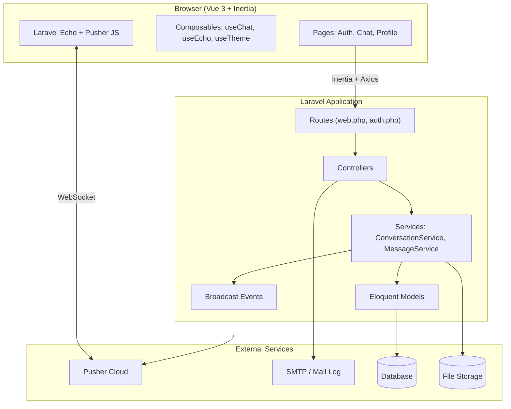
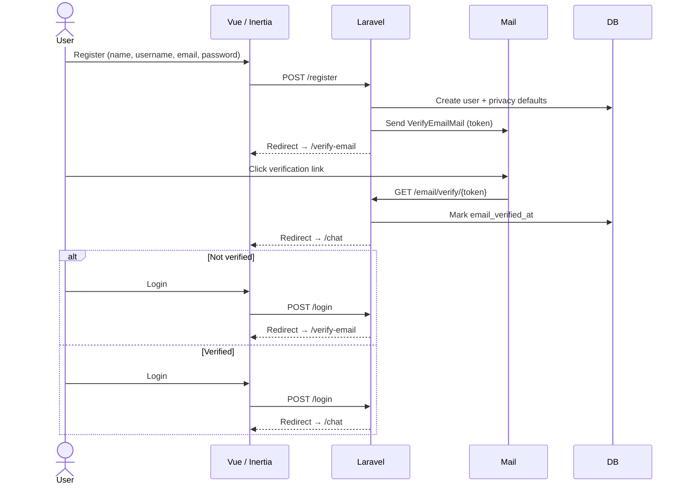
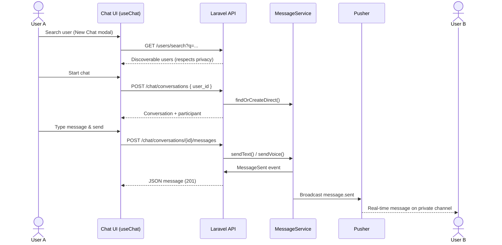
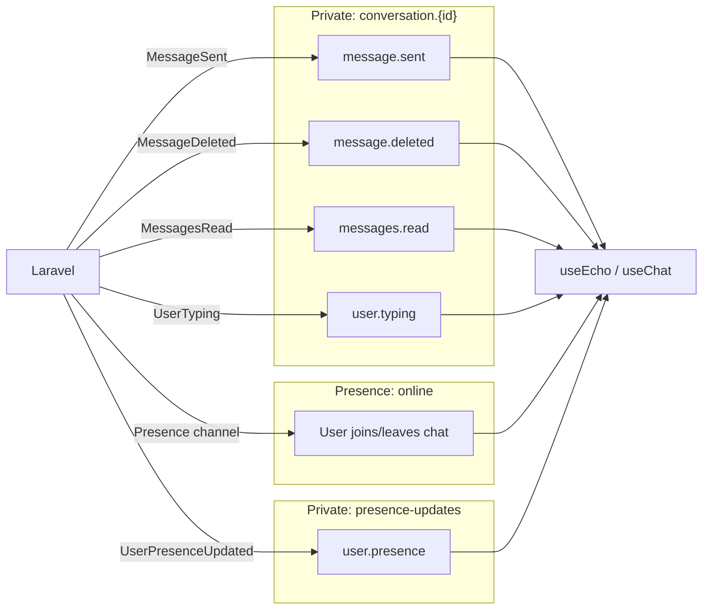
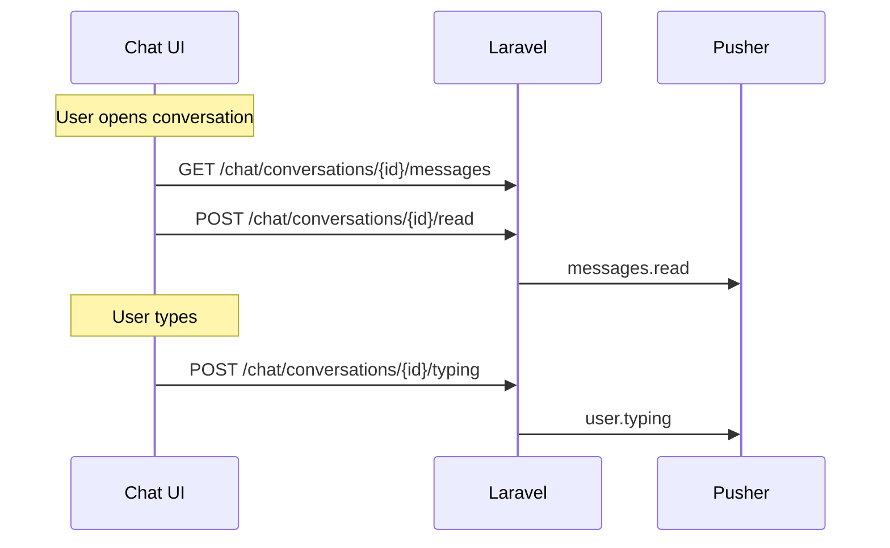
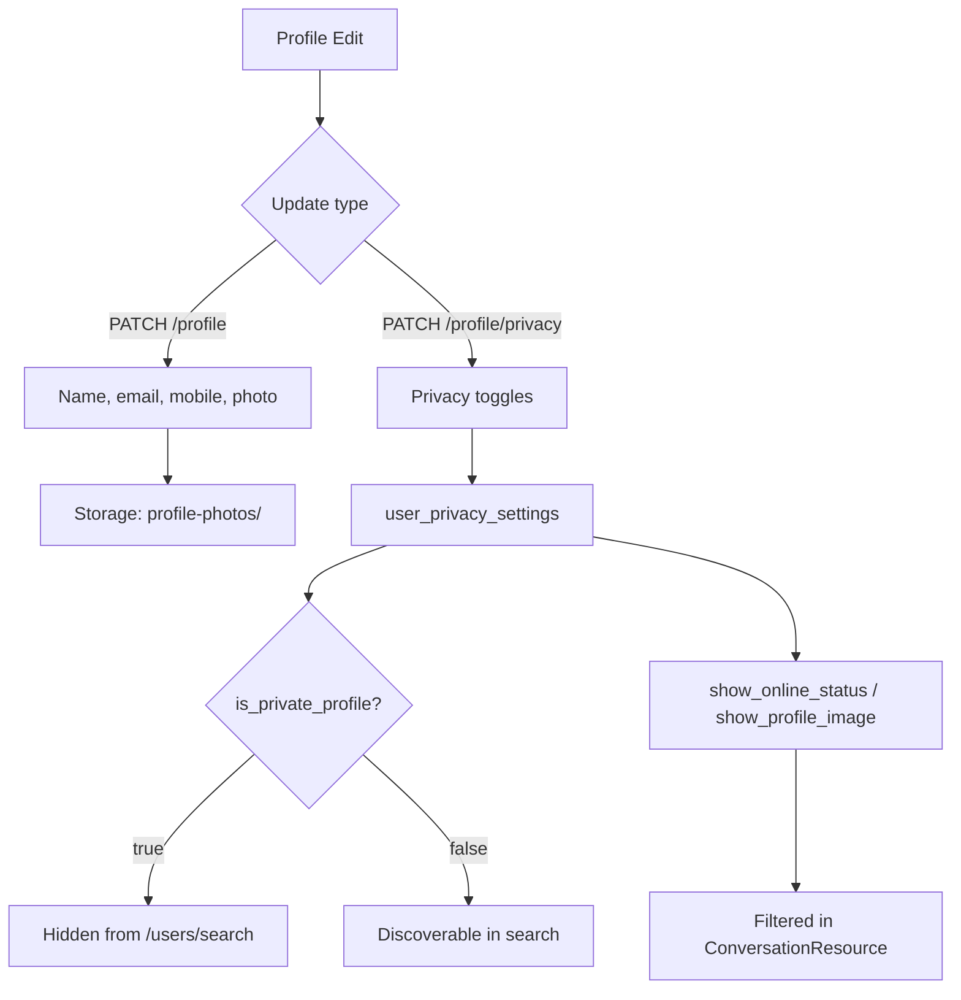
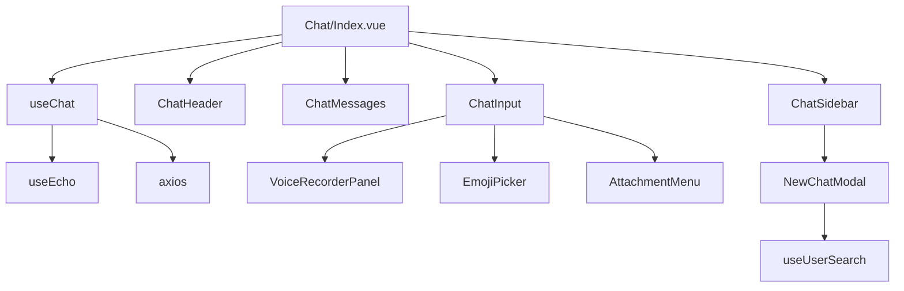

# TalkNest — Real-Time Chat Application

A full-stack messaging app built with **Laravel 12**, **Vue 3**, **Inertia.js**, and **Pusher** for real-time delivery. Users register with a unique username, verify email, search for contacts, exchange text and voice messages, and see online presence, typing indicators, and read receipts.

---

## Table of Contents

- [Features](#features)
- [Tech Stack](#tech-stack)
- [Architecture Overview](#architecture-overview)
- [Flow Diagrams](#flow-diagrams)
- [Prerequisites](#prerequisites)
- [Installation](#installation)
- [Environment Configuration](#environment-configuration)
- [Running the Application](#running-the-application)
- [Project Structure](#project-structure)
- [Database Schema](#database-schema)
- [API Routes](#api-routes)
- [Real-Time Broadcasting](#real-time-broadcasting)
- [Frontend Architecture](#frontend-architecture)
- [Testing](#testing)
- [License](#license)

---

## Features

| Area | Capabilities |
|------|----------------|
| **Authentication** | Register, login, logout, forgot/reset password |
| **Email verification** | Custom token-based verification emails (configurable expiry) |
| **Username** | Unique `@username` with live availability check during registration |
| **Chat** | One-to-one direct conversations, conversation list with unread counts |
| **Messages** | Text and voice messages; soft-delete within a 5-minute window |
| **Real-time** | Instant message delivery, typing indicators, read receipts, presence |
| **Profile** | Name, email, mobile, profile photo (cropper), privacy settings |
| **Privacy** | Private profile (hidden from search), toggle online status & avatar visibility |
| **UI** | Responsive mobile/desktop layout, dark/light theme, emoji picker |

---

## Tech Stack

| Layer | Technology |
|-------|------------|
| Backend | PHP 8.2+, Laravel 12 |
| Frontend | Vue 3, Inertia.js v2, Vite 7, Tailwind CSS |
| Real-time | Laravel Echo, Pusher (private & presence channels) |
| Auth | Laravel Breeze (session-based) |
| Database | SQLite (default) or MySQL |
| Storage | Local disk (`public` disk for voice messages & profile photos) |

---

## Architecture Overview



**Request pattern:** Inertia renders initial page props (auth user, broadcast config). Chat data is loaded and updated via JSON API calls (`axios`). Real-time updates arrive over Pusher private channels, subscribed after `window.initEcho()` runs on the chat page.

---

## Flow Diagrams

### 1. Authentication & Onboarding



**Password reset flow:** `POST /forgot-password` → email with reset link → `GET /reset-password/{token}` → `POST /reset-password` → login.

---

### 2. Starting a Conversation & Sending a Message



---

### 3. Real-Time Events (Pusher Channels)



| Event | Channel | Broadcast name | Purpose |
|-------|---------|----------------|---------|
| `MessageSent` | `private-conversation.{id}` | `message.sent` | New message to both participants |
| `MessageDeleted` | `private-conversation.{id}` | `message.deleted` | Message removed (soft delete) |
| `MessagesRead` | `private-conversation.{id}` | `messages.read` | Read receipt sync |
| `UserTyping` | `private-conversation.{id}` | `user.typing` | Typing indicator |
| `UserPresenceUpdated` | `private-presence-updates` | `user.presence` | Online/offline when tab closes |
| Presence | `presence-online` | — | Who is currently in the chat app |

Channel authorization is defined in `routes/channels.php` — only conversation participants may subscribe to a conversation channel.

---

### 4. Read Receipts & Typing



Unread counts are computed server-side by comparing message IDs to `conversation_participants.last_read_message_id`.

---

### 5. Profile & Privacy



---

## Prerequisites

- **PHP** 8.2+ with extensions: `openssl`, `pdo`, `mbstring`, `tokenizer`, `xml`, `ctype`, `json`, `fileinfo`
- **Composer** 2.x
- **Node.js** 18+ and **npm**
- **Pusher** account (free tier works for development) — [pusher.com](https://pusher.com)
- Optional: **MySQL** if not using SQLite

---

## Installation

### Quick setup (Composer script)

```bash
composer setup
```

This runs: `composer install`, copies `.env`, generates `APP_KEY`, migrates, `npm install`, and `npm run build`.

### Manual setup

```bash
# 1. Clone and enter the project
cd ChatApplication

# 2. Install PHP dependencies
composer install

# 3. Environment
cp .env.example .env
php artisan key:generate

# 4. Database
# SQLite (default): ensure database/database.sqlite exists
touch database/database.sqlite   # Linux/macOS
php artisan migrate

# 5. Storage link (profile photos & voice messages)
php artisan storage:link

# 6. Frontend
npm install
npm run build
```

---

## Environment Configuration

Copy `.env.example` to `.env` and configure:

| Variable | Description |
|----------|-------------|
| `APP_NAME` | Display name (default: `TalkNest`) |
| `APP_URL` | Base URL, e.g. `http://localhost:8000` |
| `APP_TIMEZONE` | Default: `Asia/Kolkata` |
| `DB_CONNECTION` | `sqlite` or `mysql` |
| `BROADCAST_CONNECTION` | Set to `pusher` for real-time chat |
| `PUSHER_APP_ID`, `PUSHER_APP_KEY`, `PUSHER_APP_SECRET`, `PUSHER_APP_CLUSTER` | From Pusher dashboard |
| `VITE_PUSHER_APP_KEY`, `VITE_PUSHER_APP_CLUSTER` | Exposed to Vite (auto-synced in `.env.example`) |
| `MAIL_*` | SMTP for verification & password reset (`log` driver writes to `storage/logs`) |
| `EMAIL_VERIFICATION_EXPIRE_MINUTES` | Token lifetime (default: 2 minutes, see `config/verification.php`) |
| `FILESYSTEM_DISK` | `local`; voice/images use `public` disk |
| `SESSION_DRIVER` | `database` (requires sessions migration) |

**Pusher setup:** Create an app in the Pusher dashboard, copy credentials into `.env`, and ensure `BROADCAST_CONNECTION=pusher`. Without valid Pusher keys, the app still works but messages only update on refresh (no live delivery).

**Mail setup (production):** Use `smtp` and set `MAIL_HOST`, `MAIL_PORT`, `MAIL_USERNAME`, `MAIL_PASSWORD`, `MAIL_FROM_ADDRESS`.

---

## Running the Application

### Development (all services)

Runs PHP server, queue worker, log tail, and Vite concurrently:

```bash
composer dev
```

| Service | URL / Notes |
|---------|-------------|
| Laravel | http://127.0.0.1:8000 |
| Vite HMR | Port 5173 (proxied via `@vite`) |

### Individual commands

```bash
php artisan serve          # Backend only
npm run dev                # Vite dev server
php artisan queue:listen   # If using queued jobs
```

Open **http://127.0.0.1:8000** → redirects to login.

---

## Project Structure

```
app/
├── Enums/MessageType.php          # text | voice | image
├── Events/                        # Broadcast events (MessageSent, UserTyping, …)
├── Http/Controllers/              # Chat, Conversation, Message, Profile, Auth, …
├── Http/Resources/                # API JSON transformers
├── Mail/                          # VerifyEmailMail, ResetPasswordMail
├── Models/                        # User, Conversation, Message, UserPrivacySetting
└── Services/                      # ConversationService, MessageService, EmailVerificationService

resources/js/
├── Pages/
│   ├── Auth/                      # Login, Register, VerifyEmail, Forgot/Reset Password
│   ├── Chat/Index.vue             # Main chat SPA shell
│   └── Profile/Edit.vue           # Profile & privacy
├── Components/Chat/               # Sidebar, messages, input, voice recorder, modals
├── Composables/
│   ├── useChat.js                 # Conversations, messages, send, real-time handlers
│   ├── useEcho.js                 # Pusher subscriptions (presence + per-conversation)
│   ├── useTheme.js                # Dark/light mode
│   └── useUsernameCheck.js        # Debounced username availability
├── bootstrap.js                   # Axios + initEcho()
└── app.js                         # Inertia + Vue entry

routes/
├── web.php                        # Chat, profile, broadcast auth
├── auth.php                       # Breeze auth routes + custom email verify
└── channels.php                   # Private channel authorization

database/migrations/               # Users, conversations, messages, privacy, tokens
```

---

## Database Schema

```mermaid
erDiagram
    users ||--o{ conversation_participants : joins
    users ||--o| user_privacy_settings : has
    users ||--o{ messages : sends
    users ||--o{ email_verification_tokens : has
    conversations ||--o{ conversation_participants : has
    conversations ||--o{ messages : contains

    users {
        bigint id PK
        string name
        string username UK
        string email UK
        string mobile nullable
        string profile_photo nullable
        timestamp email_verified_at nullable
        timestamp last_seen_at nullable
        string password
    }

    conversations {
        bigint id PK
        timestamps created_at updated_at
    }

    conversation_participants {
        bigint id PK
        bigint conversation_id FK
        bigint user_id FK
        bigint last_read_message_id nullable
    }

    messages {
        bigint id PK
        bigint conversation_id FK
        bigint user_id FK
        string type
        text body nullable
        string attachment_path nullable
        int attachment_duration nullable
        timestamp deleted_at nullable
    }

    user_privacy_settings {
        bigint id PK
        bigint user_id FK
        bool is_private_profile
        bool show_online_status
        bool show_profile_image
        bool show_email
        bool show_mobile
    }
```

---

## API Routes

All chat routes require `auth` + `verified` middleware.

| Method | URI | Name | Description |
|--------|-----|------|-------------|
| `GET` | `/check-username` | `username.check` | Username availability (guest OK) |
| `GET` | `/chat` | `chat` | Chat page (Inertia) |
| `GET` | `/chat/conversations` | `chat.conversations.index` | List conversations |
| `POST` | `/chat/conversations` | `chat.conversations.store` | Create/find direct chat `{ user_id }` |
| `GET` | `/chat/conversations/{id}/messages` | `chat.messages.index` | Paginated messages (`?before_id=`) |
| `POST` | `/chat/conversations/{id}/messages` | `chat.messages.store` | Send text `{ body }` or voice `{ voice, duration }` |
| `POST` | `/chat/conversations/{id}/read` | `chat.conversations.read` | Mark conversation read |
| `POST` | `/chat/conversations/{id}/typing` | `chat.conversations.typing` | Broadcast typing |
| `DELETE` | `/chat/messages/{id}` | `chat.messages.destroy` | Soft-delete (5 min window) |
| `POST` | `/chat/presence/online` | `chat.presence.online` | Mark user online |
| `POST` | `/chat/presence/offline` | `chat.presence.offline` | Mark user offline |
| `GET` | `/users/search` | `users.search` | Search discoverable users |
| `GET/PATCH` | `/profile` | `profile.edit` / `profile.update` | Profile page & update |
| `PATCH` | `/profile/privacy` | `profile.privacy.update` | Privacy settings |

Auth routes are in `routes/auth.php` (register, login, logout, password reset, email verification).

---

## Real-Time Broadcasting

1. **Server:** Events implement `ShouldBroadcastNow` and publish to Pusher immediately.
2. **Auth:** `Broadcast::routes()` in `web.php` — Echo authenticates via `POST /broadcasting/auth` with CSRF.
3. **Client:** `HandleInertiaRequests` shares `broadcast.key`, `broadcast.cluster`, and `broadcast.enabled`.
4. **Init:** On chat mount, `useEcho().init()` calls `window.initEcho(config)` from `bootstrap.js`.
5. **Per conversation:** `useChat` calls `subscribeToConversation(id, handlers)` when a contact is selected.

If Pusher is disabled, the UI falls back to HTTP-only (polling is not implemented — refresh or navigate to reload).

---

## Frontend Architecture



**Key composables:**

- **`useChat`** — Loads conversations/messages, sends messages, handles Echo events, unread state, mobile list/chat views.
- **`useEcho`** — Presence channel (`online`), `presence-updates`, per-conversation private channels.
- **`useTheme`** — Persists light/dark preference in `localStorage`.
- **`useUsernameCheck`** — Debounced `GET /check-username` on the register form.

---

## Testing

```bash
composer test
# or
php artisan test
```

Feature tests cover authentication, registration, email verification, password reset, and profile updates under `tests/Feature/`.

---

## License

This project is open-sourced software licensed under the [MIT license](https://opensource.org/licenses/MIT).
